# Autopsy 

type sudo autopsy in the terminal
Open http://localhost:9999/autopsy in Firefox
Select New case
Case Name: The name of this investigation == اسم التحقيق/ القضية
it is like the name of the project  
*N.B : It can contain only letters, numbers, and symbols*
if the investigation Hacking / Intrusion Case or Data Theft Case or CTF Challenge !! 
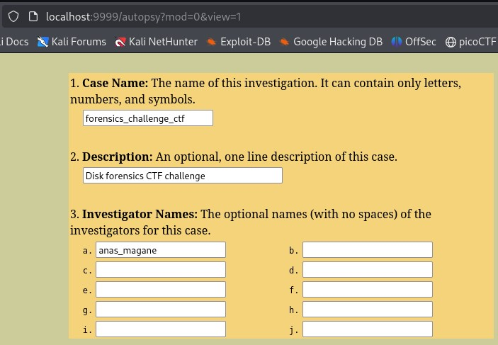

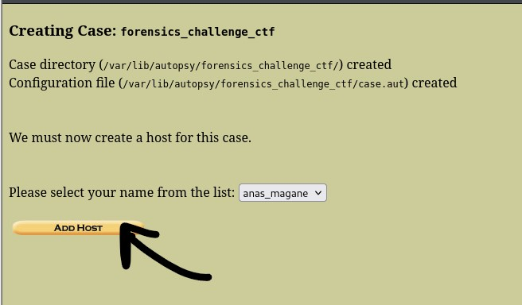

now the host is the investigated computer.
the Name of  ===  Victim_PC1
description === Main victim laptop - CTF challenge PC
Time Zone === Computer time zone.
Timeskew Adjustment === Clock correction in seconds.
Alert Hash Database === Path to known bad file hashes - Used to detect malware.
Ignore Hash Database === Path to known good file hashes - Used to ignore normal system files.
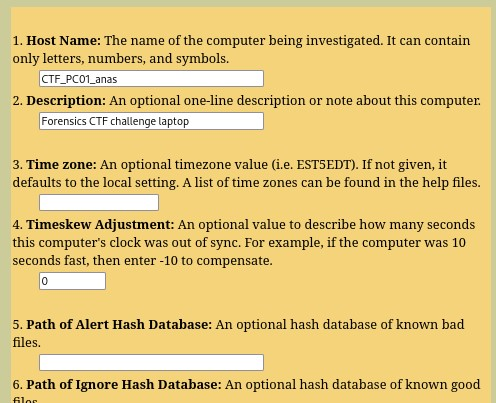

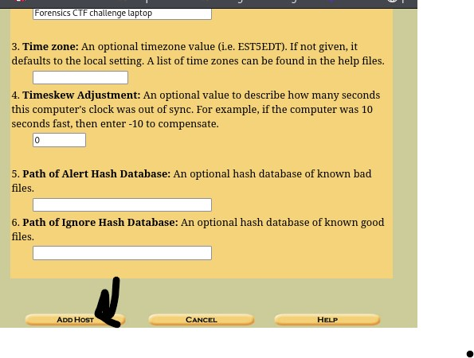

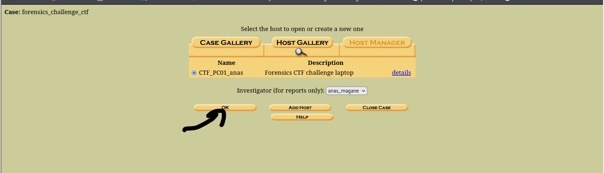
 click in Add Image File and select the disk --- exemples disk.img , disk.dd , disk.E01 ,disk.ad1

 

the path exemple : in linux /home/kali/Desktop/disk.img 
in windows D:\forensics\disk.dd
if you have (Split Image )  like
disk.E01
disk.E02
disk.E03
you need to type  disk.*
exemple
/home/kali/disk.*

Type

Choose the image type:

🟢 Disk

Full physical disk with partitions.

Example:

dd if=/dev/sda of=disk.img

🟢 Partition

Single partition only.

Example:

dd if=/dev/sda1 of=part.img

📌 How to know?

Run:

mmls disk.img

If partitions exist → Disk
If not → Partition

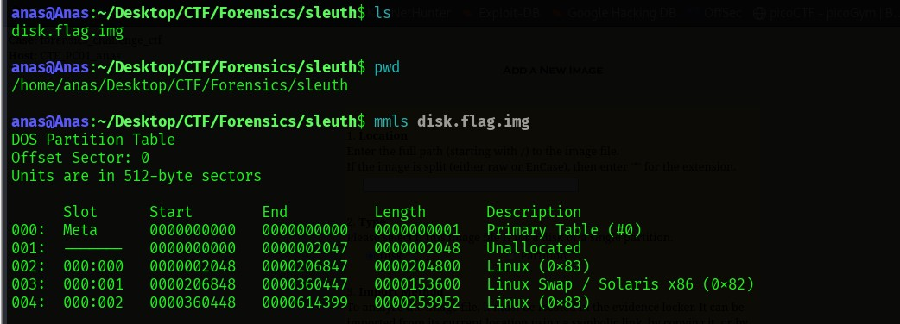

📌 3️⃣ Import Method

How Autopsy imports the image.

🟢 Symlink

Creates a shortcut.
✔ Fast
✔ No extra space
❌ Original file must stay

🟢 Copy

Copies the file.
✔ Safe
✔ Preserves original
❌ Uses disk space

🟢 Move

Moves the file.
❌ Risky
❌ May corrupt image
Not recommended.

**Data Integrity (MD5 hash)**

Autopsy allows you to:

Ignore the hash
→ Skip verification (not recommended)

Calculate hash ✅
→ Recommended for training or legal cases

Add existing MD5 hash
→ If known from prior source

Verify hash after importing?
✔ Ensures image did not change during import.

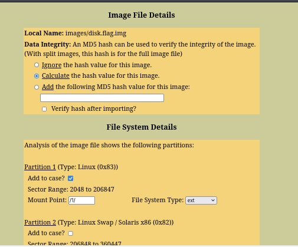

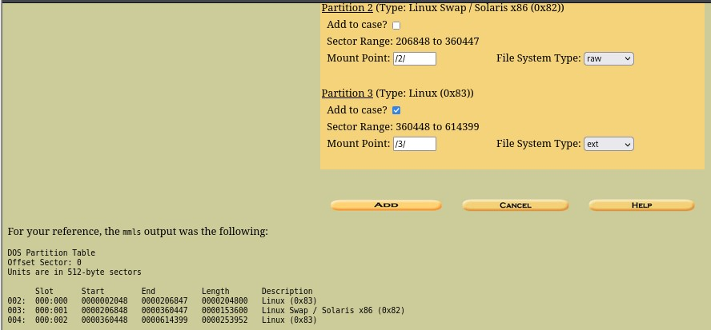

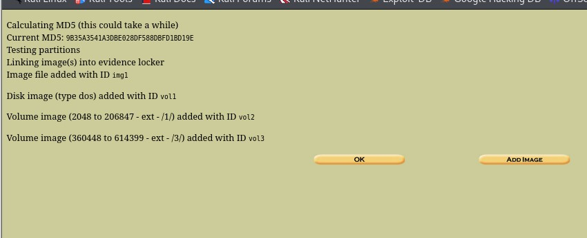

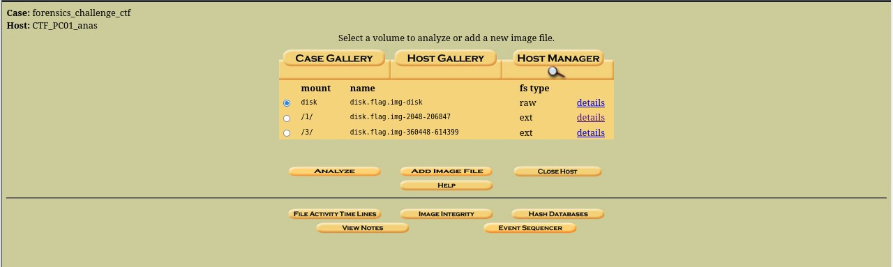

| Tab            | Purpose                           |
| -------------- | --------------------------------- |
| File Analysis  | Browse files in the volume        |
| Keyword Search | Search keywords (flag, password…) |
| File Type      | Show files by type                |
| Image Details  | Image / volume info               |
| Meta Data      | Show metadata per file            |
| Data Units     | Show sectors / clusters           |

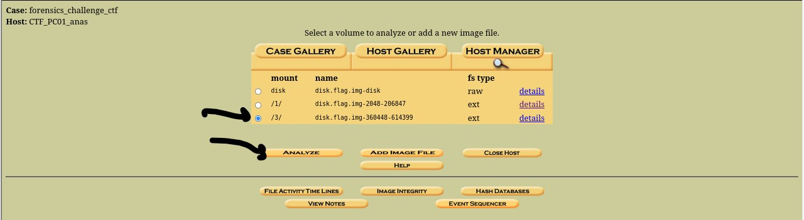
exemple outputs of analyzing disk C windows machine

when you click on file analyze you have this results as u can see
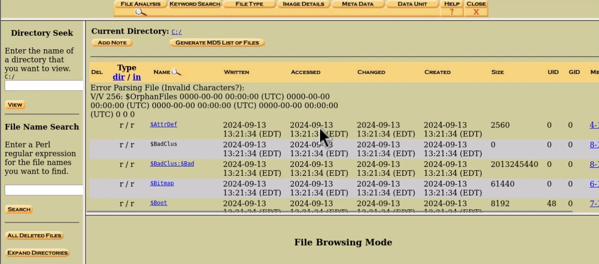

the deleted files are en red  you can see all contents and you can export extract the content 
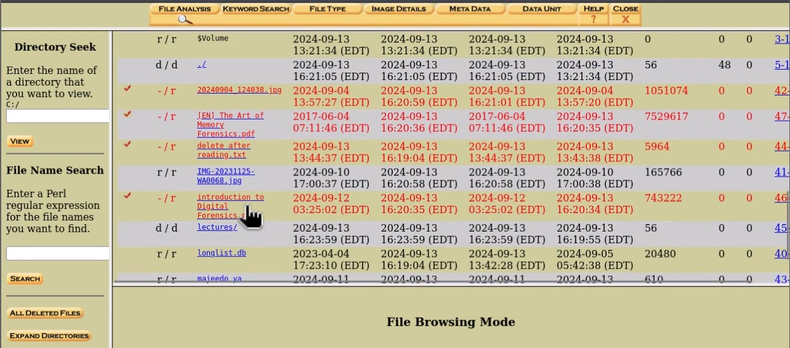

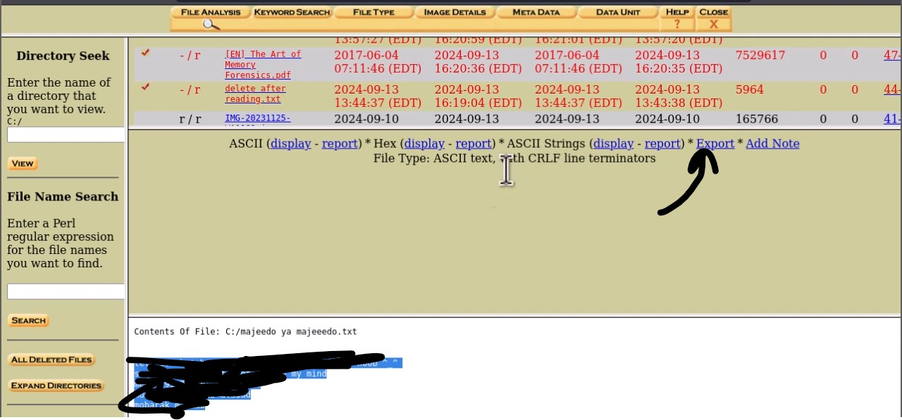

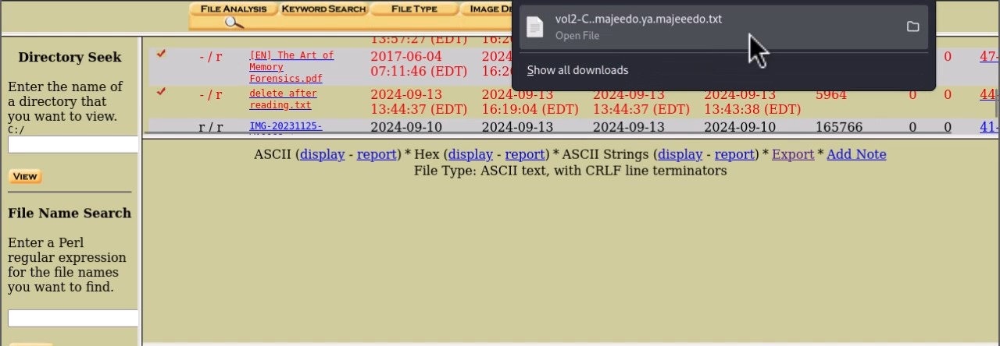

in our case we continue analyzing our linux partition part3

extract the flag.txt
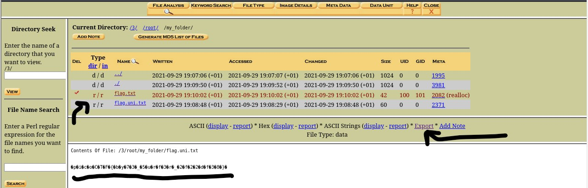

